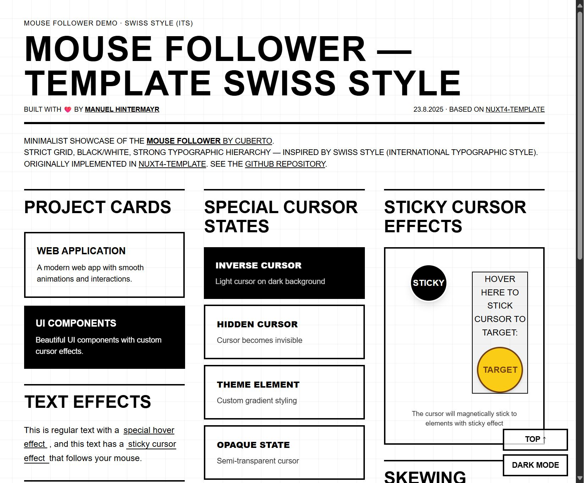
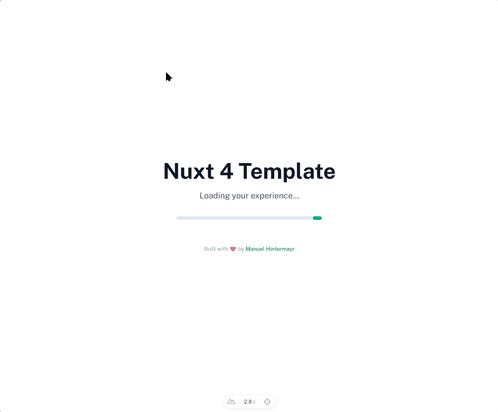

# Mouse Follower Demo — Swiss Style

A minimalist showcase for the [Mouse Follower by Cuberto](https://github.com/Cuberto/mouse-follower), inspired by Swiss Style (International Typographic Style). Features a strict grid, strong typographic hierarchy, and modern UI built with Vue 3, Tailwind CSS, and GSAP.



**🌐 Live Demo:** [http://projects.manuelhintermayr.com/mouse-follower-demo](http://projects.manuelhintermayr.com/mouse-follower-demo)

**Developed by:** [Manuel Hintermayr](https://manuelhintermayr.com)
**Repository:** https://github.com/manuelhintermayr/mouse-follower-demo

## 🚀 Features

- 🐭 **Mouse Follower** — Smooth, customizable cursor effects by Cuberto
- 🎨 **Swiss Style Layout** — Strict grid, black/white, strong typographic hierarchy
- ⚡️ **Vue 3** — Modern JavaScript framework
- 💨 **Tailwind CSS** — Utility-first CSS framework
- 🎬 **GSAP & ScrollTrigger** — Professional-grade animations and scroll effects
- 🌙 **Dark Mode** — Toggle dark/light mode
- 📱 **Responsive Design** — Mouse Follower works only on desktop (not activated on touch gestures)



## 🛠️ Technology Stack

- **[Vue 3](https://vuejs.org/)**
- **[Tailwind CSS](https://tailwindcss.com/)**
- **[GSAP](https://greensock.com/gsap/)** & **[ScrollTrigger](https://greensock.com/scrolltrigger/)**
- **[Mouse Follower](https://github.com/Cuberto/mouse-follower)**

## 📦 Installation

```bash
git clone https://github.com/manuelhintermayr/mouse-follower-demo.git
cd mouse-follower-demo
# Open index.html directly or serve with a static server
```

## 🏗️ Project Structure

```
mouse-follower-demo/
├── index.html           # Main demo page
├── README.md            # Project documentation
├── media/               # Images & video assets
│   ├── preview.jpg
│   ├── preview.gif
│   ├── avatar_1.jpg
│   ├── sample.jpg
│   └── sample.mp4
└── ...                  # Additional HTML files
```

## 🐭 Mouse Follower Integration

- Cursor changes automatically on interactive elements (links, buttons)
- Custom states via data attributes (e.g. `data-cursor="-pointer"`, `data-cursor="-inverse"`)
- GSAP-powered smooth animations

## 🎬 GSAP Animations

- Scroll-based reveal effects for sections
- Subtle transitions for cards and UI elements

## 🌙 Dark Mode

- Toggle dark/light mode via sticky controls
- Uses Tailwind's dark mode class on `<html>`

## 🤝 Contributing

Feel free to fork, customize, and submit pull requests!

## 📄 License

The project's own source code is available under the [MIT License](LICENSE). The third-party libraries used by this demo — [Mouse Follower](https://github.com/Cuberto/mouse-follower) by Cuberto (MIT), GSAP, Vue, and Tailwind CSS — are loaded from public CDNs and are documented in [THIRD_PARTY_NOTICES.md](THIRD_PARTY_NOTICES.md).

---

**Happy coding!** 🚀

Built with ❤️ by [Manuel Hintermayr](https://manuelhintermayr.com)
